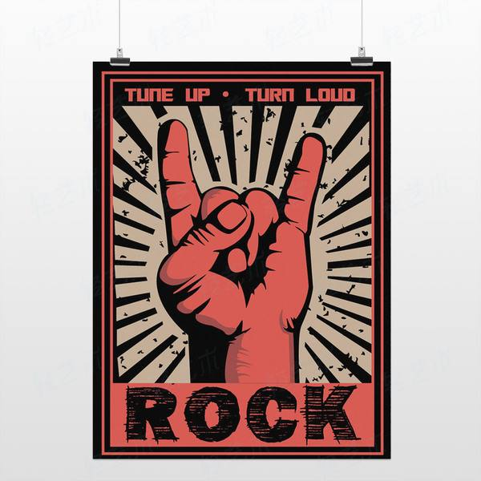
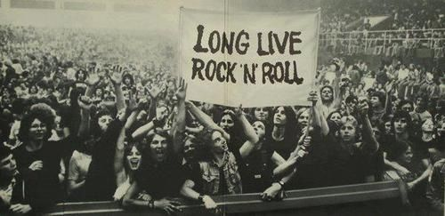

```{r setup, include=FALSE}
knitr::opts_chunk$set(echo = TRUE)
```

<center>


</center>

# Introduction

In the past 50 years, all kinds of music in the world have made great progress, of which the development of rock music is the most representative. I will show the development and change of world music through the analysis of the change of rock music in this 
project.


```{r, message=FALSE, warning=FALSE, echo=FALSE}

# load required packages

library(tidyverse)
library(tidytext)
library(ggplot2)
library(plotly)
library(DT)
library(tm)
library(data.table)
library(scales)
library(wordcloud2)
library(gridExtra)
library(ngram)
library(shiny) 
library(syuzhet)
library(d3heatmap)
library(dplyr)
library(reshape2)
library(ggpubr)
library(wordcloud)
library(mime)
library(devtools)


# load lyrics data

load('../output/processed_lyrics.RData') 

# load artist information

dt_artist <- fread('../data/artists.csv') 

# clean the data

years <- seq(1970,2010,by = 10)
dt_lyrics1 <- dt_lyrics %>% 
  filter(year >= 1970) %>% 
  mutate(word = str_count(lyrics, 
                           pattern = '\\w+'))
dt_lyrics2 <- cbind(dt_lyrics1, decade = years[findInterval(dt_lyrics1$year, years)])

# In order to better analyzing the data, I only select the data from 1970 to latest

```

## An overall analysis of every genre of music

I count and chart the number of songs of all music types over the past 50 years.

```{r, echo=FALSE, message=FALSE, warning=FALSE}
genrec <- dt_lyrics %>% 
  count(genre, sort = TRUE)

# Total songs of every genre of music

ggplot(data = genrec, aes(x = genre, y = n)) +
  geom_bar(aes(fill = genre), stat = "identity") +
  theme(legend.position = "none") +
  xlab("Gnere") +
  ylab("Count") +
  ggtitle("Total numbers of every genre")+
  scale_x_discrete(labels = function(labels) {
    sapply(seq_along(labels), function(i) paste0(ifelse(i %% 2 == 0, '', '\n'), labels[i]))
    }) +
  theme_minimal() 
```


```{r, echo=FALSE, message=FALSE, warning=FALSE}
# The propotion of every genre of music

plot_ly() %>% add_pie(data = genrec, 
                      labels = ~genre, 
                      values = ~n,
                      name = names(genrec)[1],
                      domain = list(row = 0, column = 0))
```


We can find out in above two graphics that Rock music counts 51.6 percent of total number of songs of every genre in the last 50 
years. For this reason, I decide to only analyze Rock music because I think this kind of music can better show us the real history 
and development of music in the last 50 years.

## Basic information of rock music

I will show you the overall information of rock music about what is the high frequency words and wordcloud graphic of it.

```{r, echo=FALSE, message=FALSE, warning=FALSE}

# Filter out rock music data

rockm <- dt_lyrics1 %>% filter(genre == "Rock")
rockm1 <- cbind(rockm, decade = years[findInterval(rockm$year,years)])
corpus <- VCorpus(VectorSource(rockm$stemmedwords))
corpus1 <- VCorpus(VectorSource(dt_lyrics2$stemmedwords))
wordt <- tidy(corpus) %>%
  select(text) %>%
  mutate(id = row_number()) %>%
  unnest_tokens(word, text)

# Top 10 high frequency words of rock music

nw <- count(wordt, word, sort = TRUE)
nw[1:10,] %>%
  mutate(word = reorder(word, n)) %>%
  ggplot(aes(word, n)) +
  geom_col(fill="orange") +
  labs(title = "Word frequency in rock music")+
  xlab(NULL) +
  ylab("Word Frequency")+
  coord_flip()+
  theme_minimal() 
```

```{r, echo=FALSE, message=FALSE, warning=FALSE}
# Only show top 100 words in frequecy to build up wordcloud

a <- as.data.frame(table(wordt$word), stringsAsFactors = F) 
a <- a[order(-a[, 2]), ] 
top100_word <- a[1:100, ]

# Build up the wordcloud graphic of rock music

devtools::install_github("lchiffon/wordcloud2")
library(wordcloud2)

wordcloud2(top100_word, 
           size=1, 
           color = 'random-dark', 
           backgroundColor = 'light', 
           shape = 'diamond',
           rotateRatio = 0.2)

```

we can see from the high frequency word and wordcloud graphic that `love`, `youre` and `time` are the most appeared words rock 
artists every used in the last 50 years, so I guess this kind of music expressed some kind of positive spirit in the development 
of music. To test my guess, I decided to do an sentimental analysis of the lyrics of rock music.

## High frequency word of rock music in decade

I wanna analyze the change of rock music in the last 50 years, so I plot the high frequency word graphics to show the top 10 high
frequency word of evry decade.

```{r, echo=FALSE, message=FALSE, warning=FALSE}
wordtt <- tidy(corpus1) %>%
  select(text) %>%
  mutate(id = row_number()) %>%
  left_join(dt_lyrics2, by = "id") %>%
  select(id, text, year, genre, decade) %>%
  filter(genre == "Rock") %>%
  unnest_tokens(word, text)
wordtt1970 <- wordtt %>%
  filter(decade == "1970") %>%
  count(word, sort = TRUE) %>%
  mutate(word = reorder(word, n))
wordtt1980 <- wordtt %>%
  filter(decade == "1980") %>%
  count(word, sort = TRUE) %>%
  mutate(word = reorder(word, n))
wordtt1990 <- wordtt %>%
  filter(decade == "1990") %>%
  count(word, sort = TRUE) %>%
  mutate(word = reorder(word, n))
wordtt2000 <- wordtt %>%
  filter(decade == "2000") %>%
  count(word, sort = TRUE) %>%
  mutate(word = reorder(word, n))
wordtt2010 <- wordtt %>%
  filter(decade == "2010") %>%
  count(word, sort = TRUE) %>%
  mutate(word = reorder(word, n))

p1 <- ggplot(wordtt1970[1:10, ], aes(word, n, fill = word)) +
  geom_col() +
  xlab(NULL) +
  coord_flip() +
  labs(x = "Word", 
       y = "Frequency",
       title = "1970") +
  theme_light()
p2 <- ggplot(wordtt1980[1:10, ], aes(word, n, fill = word)) +
  geom_col() +
  xlab(NULL) +
  coord_flip() +
  labs(x = "Word", 
       y = "Frequency",
       title = "1980") +
  theme_light()
p3 <- ggplot(wordtt1990[1:10, ], aes(word, n, fill = word)) +
  geom_col() +
  xlab(NULL) +
  coord_flip() +
  labs(x = "Word", 
       y = "Frequency",
       title = "1990") +
  theme_light()
p4 <- ggplot(wordtt2000[1:10, ], aes(word, n, fill = word)) +
  geom_col() +
  xlab(NULL) +
  coord_flip() +
  labs(x = "Word", 
       y = "Frequency",
       title = "2000") +
  theme_light()
p5 <- ggplot(wordtt2010[1:10, ], aes(word, n, fill = word)) +
  geom_col() +
  xlab(NULL) +
  coord_flip() +
  labs(x = "Word", 
       y = "Frequency",
       title = "2010") +
  theme_light()
ggarrange(p1, p2, p3, p4, p5, common.legend = TRUE)

```

It can be seen from the chart that the vocabulary of top3 has not changed in every decade, while `heart` has appeared since the 1990s, 
and `night` vocabulary has become less since the 1990s, which is a special trend.

## How rock music change in decade

Next, I want to observe the overall development of rock music in the past 50 years.

```{r, echo=FALSE, message=FALSE, warning=FALSE}
wordt1 <- wordt %>% 
  group_by(id) %>% 
  count()
rockm1$nstemmedwords <- wordt1$n

songw <- rockm1 %>% 
  select(id, decade, nstemmedwords) %>%
  mutate(decade = as.character(decade))

plot_ly(x = songw$decade, y = songw$nstemmedwords, color = songw$decade, type = 'box') %>% 
  layout(xaxis = list(title = 'Rock Music'), 
         yaxis = list(range = c(0, 300), title = 'Lyric length of Rock music'))
```

It seems like the length of rock music song had a slightly decreased in the last 50 years.

To better analyze the rock music, I am gonna count the total words used by rock music in every decade.

```{r, echo=FALSE, message=FALSE, warning=FALSE}
lw <- rockm1 %>% 
  group_by(decade) %>% 
  summarise(word = sum(word))
lw %>% arrange(desc(decade)) %>%
  ggplot(aes(x = reorder(decade, -word), y = word, fill = decade)) +
  geom_bar(stat = 'identity') + 
  ylab("Word count") + 
  xlab ("") + 
  ggtitle("Word count change over decade") + 
  theme_minimal()
```

```{r, echo=FALSE, message=FALSE, warning=FALSE}
nw <- rockm1 %>%
  select(decade, word) %>%
  group_by(decade) %>%
  mutate(total_word = sum(word)) %>%
  select(decade, total_word) %>%
  distinct(decade, total_word) %>%
  arrange(decade)
ggplot(nw, aes(x = factor(decade), y = total_word, group = 1)) +
  geom_line(colour="#1CCCC6", size=1) + 
  ylab("Word count by decade") + 
  xlab("Year") + 
  ggtitle("Total word of rock music song change by decade") + 
  theme_minimal() 
```

we can see from the above two charts that total word of rock music attach a peak in 2000s, it means this genre of music had a great development at this age, though the length of rock music song had a slightly decreased.

After some basic information of rock music showed above, I know the development of rock music which can represent the development of 
modern music perfectly. 

Next, I wanna analyze the rock music from another perspective.

## Sentiment analysis of rock music

To prove the previous speculation on the emotional expression of rock music, I will conduct customs clearance analysis on rock music 
to explore how the emotional expression of rock music is.

```{r, echo=FALSE, message=FALSE, warning=FALSE}

# Text processing

rockmt <- rockm$lyrics
rockmt <- gsub('[[:punct:]]+', '', rockmt)
rockmt <- gsub("([[:alpha:]])\1+", "", rockmt)

# I will use `nrc` method in `syuzhet` package to grade the sentiment of lyrics

tys <- get_nrc_sentiment(rockmt)
sentiments <- data.frame(colSums(tys[, ] / 10))

# To better represent the score, I divided the original score by 10

names(sentiments) <- "Score"
sentiments <- cbind("Sentiment" = rownames(sentiments), sentiments)
rownames(sentiments) <- NULL

# Plot cumulative sentiment scores

ggplot(data = sentiments, aes(x = Sentiment, y = Score))+
  geom_bar(aes(fill = Sentiment), stat = "identity")+
  theme(legend.position = "none")+
  xlab("Sentiments")+
  ylab("Scores")+
  ggtitle("Total sentiment based on scores")+
  theme_minimal() 

```

The chart shows that the score of positive emotion is relatively close to that of negative emotion, 340605 and 346829 respectively, but the score of negative emotion is slightly higher. In terms of mood, anticipation, sadness and joy are the top three.

To better understand the sentiment change of rock music, I plot sentiment culmulative graphic of every decade.

```{r, echo=FALSE, message=FALSE, warning=FALSE}
sentiment <- get_sentiments("nrc")

rocksd <- rockm1 %>%
  select(genre, decade, stemmedwords) %>% 
  unnest_tokens(word, stemmedwords) %>%
  inner_join(sentiment, by = "word") %>%
  group_by(genre, decade, sentiment) %>%
  summarise(n = n()) 

ggplot(rocksd, aes(x = decade, y = n, fill = sentiment))+
  geom_bar(stat = "identity")
```

We can see from the graphic that 2000s age play a significant role in the sentiment scores calculating.

Now that we've worked out the total score of emotions, I'm going to figure out whether rock music has a higher positive or negative score next.

```{r, echo=FALSE, message=FALSE, warning=FALSE}

# Add decade column into the rock music dataset

rockm1$lyrics <- as.character(rockm1$lyrics)

tl <- rockm1 %>% 
  unnest_tokens(word, lyrics)
swc <- tl %>% 
  count(song)
lyricc <- tl %>%
  left_join(swc, by = "song") %>% 
  rename(total_words = n)
lyricc %>% inner_join(get_sentiments('bing'), by = 'word') %>%
  select('sentiment')%>%
  group_by(sentiment)%>%
  summarize(freq = n())%>%
  ungroup()%>%
  ggplot(aes(x = sentiment, y=freq))+
  geom_bar(position = 'dodge',
           stat = 'identity',
           fill = c('darkred', 'darkblue'))
```

## How sentiment ofrock music change in decade

This chart shows that most of the words they use in songs tend to be negative emotions. It is different from my guess, so I decide to 
plot the heatmap to show the emotion different of rock music in different decade.

```{r, echo=FALSE, message=FALSE, warning=FALSE}
dls <- (1 / rockm1$word * tys) %>% 
  mutate(label = paste(rockm1$decade))
sm <-tbl_df(dls)%>%
  group_by(label)%>%
  summarise(
    anger = mean(anger, na.rm=TRUE),
    anticipation = mean(anticipation, na.rm=TRUE),
    disgust = mean(disgust, na.rm=TRUE),
    fear = mean(fear, na.rm=TRUE),
    joy = mean(joy, na.rm=TRUE),
    sadness = mean(sadness, na.rm=TRUE),
    surprise = mean(surprise, na.rm=TRUE),
    trust = mean(trust, na.rm=TRUE),
    negative = mean(negative, na.rm=TRUE),
    positive = mean(positive, na.rm=TRUE),)
rn <- sm$label;
sm <- sm[,-1] %>% 
  data.matrix();
rownames(sm) <- rn
d3heatmap(sm, scale="none", colors= "Blues",
          xaxis_font_size = 15, Rowv = FALSE,
          Colv=FALSE, show_grid=TRUE)
```

we can see in the heatmap that though the total sentiment score of negative is slightly higher than positive, but they are similar to 
each other in every decade. In detail, rock music is much more negative in 1980s, but it become more positve since 1990 till now.

According to the sentiment score, I want to use `bing` to create a comparative word cloud of positive and negative sentiment.

```{r, echo=FALSE, message=FALSE, warning=FALSE}
# Plot the score graphic of emotion

tl %>% inner_join(get_sentiments("bing"), by = 'word') %>%
  count(word, sentiment, sort = TRUE) %>%
  acast(word ~ sentiment, value.var = "n", fill = 0) %>%
  comparison.cloud(colors = c("red", "blue"),
                   max.words = 250)
```

this wordcloud shows that the amount of postive words and negative words are similar, positive words are `love`, `like`, `right` and so on; negative words are `lost`, `hard`, `wrong` and so on.

## Summary
1. The overall analysis shows that rock music accounts for 51.6% of the total works of all music types in the past 50 years, so rock music can be used to represent the development of music in the past 50 years.
2. The main expressions of rock music are positive, such as "love", which is a typical word. From the perspective of age, 2000s age is the year of the eruption of rock music works.
3. The proportion of positive elements and negative elements in the emotional expression of rock music is roughly the same, which is very consistent with the shouting music of rock music. it often sings the inner demands of rock singers, which are diversified.

<center>


</center>

